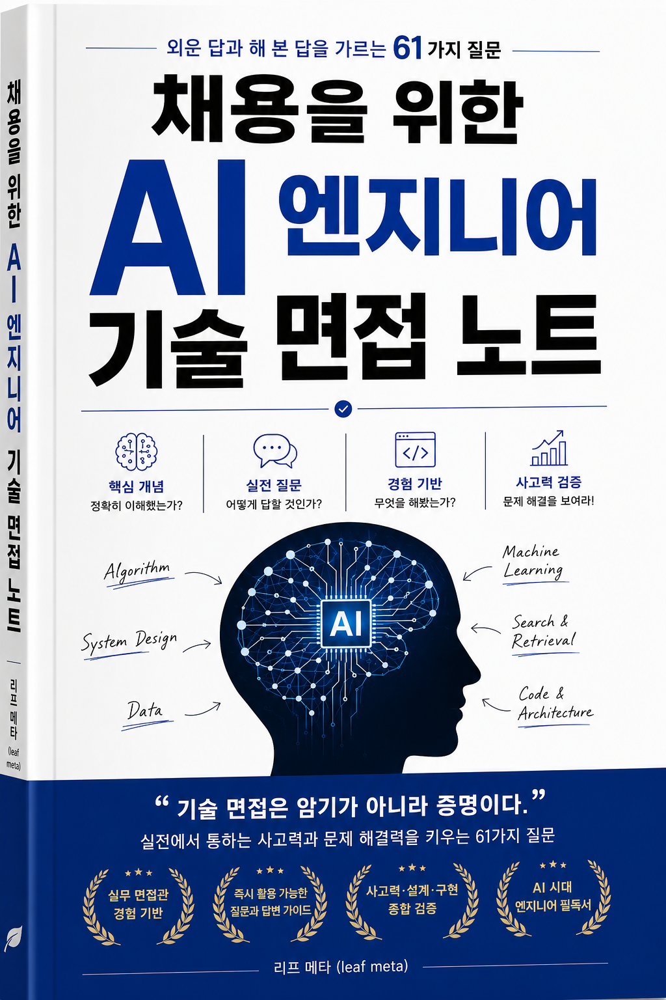

# 채용을 위한 AI 엔지니어 기술 면접 노트

**모르는 사람은 티가 납니다. 그런데 읽고 온 사람은 해 본 사람과 똑같이 말합니다.**

지원자의 절반이 도구로 답을 준비해 오는 지금, 매끄러운 답은 아무것도 안 가릅니다.
그래서 이 책은 답을 안 듣습니다.

> ### 답을 듣지 마세요. 안 고른 쪽을 물으세요.

해 본 사람은 자기가 버린 선택지를 말할 수 있습니다. 그게 아직 몸에 남아 있거든요.
청크 크기를 512로 잡았다면 그 전에 256을 써 봤고, 왜 바꿨는지 숫자로 기억합니다.
읽고 온 사람은 512만 말합니다. 512가 정답으로 적혀 있었으니까요.

**질문 61개.** 하나마다 실제로 받은 답변, 빈자리를 찍은 같은 답변,
파고든 뒤에 나온 답변, 그리고 통과 조건과 안 보낼 조건이 붙어 있습니다.

---

## 내려받기

### → [PDF 받기](https://github.com/leaf-kit/book-ai-interview/releases/latest)

332쪽 · 질문 61개 · 도식 95개 · 무료

---

## 목차

**1. 매끄러운 답의 정체** — 준비된 답은 왜 신호가 아닌가  
<sub>[매끄러움이 왜 신호가 아닌가](docs/q001.md), [외운 답의 버릇 열 가지](docs/q002.md), [물은 것과 받은 것을 나란히](docs/q003.md), [빈자리 일곱 군데](docs/q004.md), [30초 첫 판정](docs/q005.md)</sub>

**2. 해 본 사람의 말투** — 숫자, 시점, 버린 쪽, 남의 이름, 못 한 것  
<sub>[같은 질문, 두 답변](docs/q006.md), [해 본 사람이 늘 하는 다섯 가지](docs/q007.md), [어느 쪽 빈자리가 더 위험한가](docs/q008.md), [섞인 답, 해 본 것과 읽은 것이 섞였을 때](docs/q009.md)</sub>

**3. 듣는 연습** — 답변 넷을 나란히 놓고 훑는 순서  
<sub>[답변 넷을 나란히 놓고 훑는 순서](docs/q010.md), [말을 잘하는 사람과 아는 사람을 가르는 법](docs/q011.md), [준비를 잘해 온 게 죄인가요](docs/q012.md)</sub>

**4. 좋은 질문과 나쁜 질문** — 잣대를 지원자에게서 나에게로 돌린다  
<sub>[같은 주제, 두 질문. 무엇이 갈랐나](docs/q013.md), [나쁜 질문의 공통점 다섯](docs/q014.md), [좋아 보이는데 나쁜 질문 셋](docs/q015.md), [꼬리 질문 쓰는 법](docs/q016.md)</sub>

**5. 면접하는 법** — 45분을 어떻게 나누고 무엇을 적는가  
<sub>[면접은 무엇을 하는 자리인가](docs/q017.md), [45분 절차](docs/q018.md), [평가표 한 장과 여섯 렌즈](docs/q019.md)</sub>

**6. 물어보는 법** — 확인할 것을 먼저 문장으로 쓴다  
<sub>[무엇을 확인할 것인지 먼저 문장으로 쓴다](docs/q020.md), [상황을 값으로 주고 못 쓰는 것을 정해 준다](docs/q021.md), [실물을 먼저 시킨다](docs/q022.md)</sub>

**7. 결정을 센다** — 갈림길을 세고 안 고른 쪽을 묻는다  
<sub>[결정 세기, 이 프로젝트에 갈림길이 몇 개였나](docs/q023.md), [하나의 선택이 만든 두 세계](docs/q024.md), [안 해 본 것을 물어 확인하는 법](docs/q025.md), [남의 일과 내 일을 가르는 질문](docs/q026.md)</sub>

**8. 실패와 되돌리기** — 터진 이야기 말고 그 옆을 묻는다  
<sub>[터졌던 이야기를 꺼내는 질문](docs/q027.md), [되돌린 적이 있는가](docs/q028.md), [사고가 지나간 자리에 무엇이 남았나](docs/q029.md)</sub>

**9. 데이터를 다뤄 봤는가** — 어디서 왔고 라벨은 누가 붙였나  
<sub>[데이터가 어디서 왔는가, 라벨은 누가 붙였나](docs/q030.md), [나눈 자리와 새어 나간 자리](docs/q031.md), [지저분한 입력과 큰 입력](docs/q032.md)</sub>

**10. 모델을 다뤄 봤는가** — 무엇을 고르지 않았고 무엇을 내줬나  
<sub>[학습이냐 파인튜닝이냐 프롬프트냐](docs/q033.md), [안 되던 것을 되게 만든 과정](docs/q034.md), [크기와 지연과 비용의 삼각형](docs/q035.md)</sub>

**11. 검색과 맥락** — 뽑아 온 것 말고 안 나온 것을 센다  
<sub>[무엇을 넣고 무엇을 뺐나](docs/q036.md), [어디서 깨졌나](docs/q037.md), [못 찾은 것을 어떻게 알았나](docs/q038.md)</sub>

**12. 코드를 짜 봤는가** — 완성이 아니라 첫 3분을 본다  
<sub>[라이브 코딩에서 볼 것과 안 볼 것](docs/q039.md), [남의 코드를 읽히는 과제](docs/q040.md), [디버깅 과제, 로그 하나로 원인을 짚는가](docs/q041.md), [AI 를 쓰게 하고 무엇을 보는가](docs/q042.md)</sub>

**13. 평가** — 좋아졌다는 말에 앞 숫자를 받는다  
<sub>[좋아졌다는 말의 근거](docs/q043.md), [지표가 가리는 것](docs/q044.md), [사람이 채점한 것, 모델이 채점한 것](docs/q045.md)</sub>

**14. 시스템 설계와 규모** — 상자가 아니라 선을 본다  
<sub>[그림을 그리게 한다](docs/q046.md), [열 배가 되면 어디가 먼저 터지나](docs/q047.md), [되돌릴 수 있는 결정과 없는 결정](docs/q048.md)</sub>

**15. 운영과 안전** — 걸어 둔 것 말고 안 걸린 것을 묻는다  
<sub>[배포한 뒤에 무엇을 봤나](docs/q049.md), [조용히 나빠질 때 무엇으로 아는가](docs/q050.md), [이 입력은 누가 주는가](docs/q051.md), [틀린 답이 나갔을 때의 절차](docs/q052.md)</sub>

**16. 이력서와 사람** — 종이에서 판정을 걷어내고 질문만 뽑는다  
<sub>[이력서에서 물을 자리를 뽑는 순서](docs/q053.md), [생성된 이력서와 만든 이력서](docs/q054.md), [같이 일할 수 있는가](docs/q055.md)</sub>

**17. 원격과 도구** — 막는 대신 질문에 우리 것을 붙인다  
<sub>[화면 너머에서 답하고 있을 때](docs/q056.md), [못 잡는 대신 질문을 바꾼다](docs/q057.md), [서류를 도구에 시키는 법](docs/q058.md)</sub>

**18. 신뢰와 절차** — 합격을 등급으로 적고 저장소에 심는다  
<sub>[신뢰는 느낌이 아니라 등급이다](docs/q059.md), [받는 쪽에서 하는 일](docs/q060.md), [질문 61개를 한 장으로](docs/q061.md)</sub>

---

## 과제 코드

이 책이 예순한 번 다시 보는 검색 서비스 하나가 `tasks/` 에 있습니다.
바깥 것을 안 씁니다. 받아서 그대로 돌리면 책에 실린 숫자가 나옵니다.

```bash
cd tasks && python3 -m pytest -q
```

테스트 82개. 면접 과제로 그대로 쓰셔도 됩니다.
다만 한 군데는 바꾸세요. 그래야 이 책을 읽고 온 지원자에게도 그 자리가 갈립니다.

---

무료로 배포할 수 있습니다. 조건은 출처 표기 하나입니다. 자세한 것은 [LICENSE](LICENSE).

지은이 **리프 메타 (leaf meta)**

